# 🏗️ **ARQUITETURA INNOMA OBRAS - MULTI-TENANT**

## 📋 **Visão Geral**

O Innoma Obras utiliza uma **arquitetura multi-tenant** que permite múltiplas empresas usarem o mesmo aplicativo com **dados completamente isolados**. Cada empresa (tenant) tem seus próprios dados, usuários, configurações e limites de uso.

---

## 🏢 **ARQUITETURA MULTI-TENANT**

### 🎯 **Modelo Conceitual**

```mermaid
graph TB
    subgraph "Firebase/Cloud"
        F[Firebase Auth]
        FS[Firestore]
        FC[Firebase Storage]
    end
    
    subgraph "App Mobile"
        A[App Innoma]
        AT[Auth Context]
        TC[Tenant Context]
        PC[Permissions Context]
    end
    
    subgraph "Tenant A - Silva Construções"
        TA[Tenant A]
        UA[Usuários A]
        OA[Obras A]
        DA[Dados A]
    end
    
    subgraph "Tenant B - Costa Engenharia"
        TB[Tenant B]
        UB[Usuários B]
        OB[Obras B]
        DB[Dados B]
    end
    
    F --> AT
    AT --> TC
    TC --> TA
    TC --> TB
    TA --> UA
    TA --> OA
    TA --> DA
    TB --> UB
    TB --> OB
    TB --> DB
```



### 🔑 **Princípios Fundamentais**

1. **Isolamento Total**: Dados de uma empresa jamais são visíveis para outra
2. **Identificação Automática**: Sistema detecta automaticamente a empresa do usuário
3. **Permissões por Empresa**: Cada usuário tem perfil específico em cada empresa
4. **Limites por Plano**: Cada empresa tem limites baseados em seu plano de assinatura
5. **Sincronização Isolada**: Dados sincronizam apenas dentro da própria empresa

---

## 📊 **MODELO DE DADOS MULTI-TENANT**

### 🏢 **Estrutura de Tenants**

```sql
-- Tabela principal de empresas
CREATE TABLE tenants (
    id TEXT PRIMARY KEY,           -- UUID da empresa
    nome TEXT NOT NULL,            -- "Silva Construções LTDA"
    slug TEXT UNIQUE NOT NULL,     -- "silva-construcoes" (URL-friendly)
    email_contato TEXT NOT NULL,   -- Email principal da empresa
    cnpj TEXT,                     -- CNPJ da empresa
    
    -- Plano e status
    plano TEXT NOT NULL DEFAULT 'basico',
    status TEXT NOT NULL DEFAULT 'trial',
    
    -- Limites por plano
    limite_usuarios INTEGER DEFAULT 10,
    limite_obras INTEGER DEFAULT 5,
    limite_storage_gb INTEGER DEFAULT 1,
    
    -- Controle
    created_at DATETIME DEFAULT CURRENT_TIMESTAMP,
    updated_at DATETIME DEFAULT CURRENT_TIMESTAMP,
    is_active INTEGER DEFAULT 1
);
```

### 👥 **Usuários Multi-Tenant**

```sql
-- Usuários pertencem a UMA empresa
CREATE TABLE usuarios (
    id INTEGER PRIMARY KEY AUTOINCREMENT,
    uuid TEXT UNIQUE NOT NULL,
    tenant_id TEXT NOT NULL,        -- 🔑 CHAVE DE ISOLAMENTO
    nome TEXT NOT NULL,
    email TEXT NOT NULL,
    
    -- Perfis dentro da empresa
    perfil TEXT NOT NULL DEFAULT 'operador',  -- admin, engenheiro, mestre, etc.
    is_tenant_owner INTEGER DEFAULT 0,        -- Dono da empresa
    
    -- Relacionamento
    FOREIGN KEY (tenant_id) REFERENCES tenants(id),
    UNIQUE(tenant_id, email)        -- Email único POR EMPRESA
);
```

### 🏗️ **Dados Isolados por Empresa**

```sql
-- TODAS as tabelas de dados têm tenant_id
CREATE TABLE obras (
    id INTEGER PRIMARY KEY AUTOINCREMENT,
    uuid TEXT UNIQUE NOT NULL,
    tenant_id TEXT NOT NULL,        -- 🔑 ISOLAMENTO OBRIGATÓRIO
    nome TEXT NOT NULL,
    status TEXT DEFAULT 'planejamento',
    
    FOREIGN KEY (tenant_id) REFERENCES tenants(id)
);

CREATE TABLE tarefas (
    id INTEGER PRIMARY KEY AUTOINCREMENT,
    uuid TEXT UNIQUE NOT NULL,
    tenant_id TEXT NOT NULL,        -- 🔑 ISOLAMENTO OBRIGATÓRIO
    obra_id TEXT NOT NULL,
    titulo TEXT NOT NULL,
    
    FOREIGN KEY (tenant_id) REFERENCES tenants(id),
    FOREIGN KEY (obra_id) REFERENCES obras(uuid)
);

-- ... todas as outras tabelas seguem o mesmo padrão
```

### 📊 **Índices Otimizados**

```sql
-- Índices compostos para performance multi-tenant
CREATE INDEX idx_obras_tenant_status ON obras(tenant_id, status);
CREATE INDEX idx_tarefas_tenant_obra ON tarefas(tenant_id, obra_id);
CREATE INDEX idx_usuarios_tenant_email ON usuarios(tenant_id, email);
CREATE INDEX idx_diarios_tenant_data ON diarios(tenant_id, data_registro);
```

---

## 🔐 **SISTEMA DE AUTENTICAÇÃO MULTI-TENANT**

### 🎯 **Fluxos de Registro**

#### **1. Primeira Empresa (Bootstrap)**
```typescript
// Usuário cria nova empresa + conta
const register = async (data: RegisterData) => {
    // 1. Criar usuário no Firebase Auth
    const firebaseUser = await createUserWithEmailAndPassword(auth, email, password);
    
    // 2. Gerar ID da empresa
    const tenantId = uuidv4();
    
    // 3. Criar empresa no banco
    await createTenant({
        id: tenantId,
        nome: data.empresa || `Empresa de ${data.nome}`,
        slug: generateSlug(data.empresa),
        email_contato: data.email,
        plano: 'trial'
    });
    
    // 4. Criar usuário como owner da empresa
    await createUser({
        uuid: firebaseUser.uid,
        tenant_id: tenantId,
        nome: data.nome,
        email: data.email,
        perfil: 'admin',
        is_tenant_owner: true
    });
    
    return { user, tenant, token };
};
```

#### **2. Convite para Empresa Existente**
```typescript
// Admin convida novo membro
const inviteUser = async (email: string, role: string, tenantId: string) => {
    // 1. Verificar limites da empresa
    if (!canAddUser()) throw new Error('Limite de usuários atingido');
    
    // 2. Criar convite com token único
    const invite = await createInvite({
        tenant_id: tenantId,
        email,
        perfil_tenant: role,
        token: uuidv4(),
        data_expiracao: addDays(new Date(), 7)
    });
    
    // 3. Enviar email com link de convite
    await sendInviteEmail(email, invite.token);
};

// Usuário aceita convite
const acceptInvite = async (token: string, userData: any) => {
    // 1. Buscar convite válido
    const invite = await getInviteByToken(token);
    if (!invite || invite.status !== 'pendente') {
        throw new Error('Convite inválido ou expirado');
    }
    
    // 2. Criar/atualizar usuário no Firebase
    let firebaseUser;
    try {
        // Tentar login (usuário já existe)
        firebaseUser = await signInWithEmailAndPassword(auth, invite.email, userData.password);
    } catch {
        // Criar novo usuário
        firebaseUser = await createUserWithEmailAndPassword(auth, invite.email, userData.password);
    }
    
    // 3. Adicionar usuário à empresa
    await createUser({
        uuid: firebaseUser.uid,
        tenant_id: invite.tenant_id,
        nome: userData.nome,
        email: invite.email,
        perfil: invite.perfil_tenant,
        is_tenant_owner: false
    });
    
    // 4. Marcar convite como aceito
    await updateInvite(invite.id, { status: 'aceito' });
};
```

#### **3. Login Multi-Tenant**
```typescript
// Sistema detecta automaticamente a empresa
const login = async (credentials: LoginCredentials) => {
    // 1. Autenticar no Firebase
    const firebaseUser = await signInWithEmailAndPassword(auth, email, password);
    
    // 2. Buscar dados do usuário no banco local
    const user = await getUserByUuid(firebaseUser.uid);
    if (!user) throw new Error('Usuário não encontrado');
    
    // 3. Verificar se usuário tem empresa
    if (!user.tenant_id) throw new Error('Usuário sem empresa associada');
    
    // 4. Carregar dados da empresa
    const tenant = await getTenantById(user.tenant_id);
    if (!tenant) throw new Error('Empresa não encontrada');
    
    // 5. Definir contexto da sessão
    setCurrentUser(user);
    setCurrentTenant(tenant);
    
    return { user, tenant, token };
};
```

---

## 🛡️ **SEGURANÇA E ISOLAMENTO**

### 🔒 **Middleware de Isolamento**

```typescript
// Hook que garante isolamento automático
export const useTenantQuery = () => {
    const { currentTenant } = useTenant();
    
    const executeQuery = async (sql: string, params: any[] = []) => {
        if (!currentTenant) {
            throw new Error('Nenhuma empresa ativa');
        }
        
        // Adicionar tenant_id automaticamente em WHERE clauses
        const tenantAwareSql = addTenantFilter(sql, currentTenant.id);
        return await executeSelectQuery(tenantAwareSql, [...params, currentTenant.id]);
    };
    
    return { executeQuery };
};

// Função que adiciona filtro automático de tenant
const addTenantFilter = (sql: string, tenantId: string) => {
    // Detectar tabelas que precisam de filtro de tenant
    const tenantTables = ['obras', 'tarefas', 'diarios', 'materiais', 'documentos'];
    
    // Adicionar WHERE tenant_id = ? automaticamente
    // Implementação simplificada - versão real seria mais robusta
    return sql.includes('WHERE') 
        ? sql.replace('WHERE', `WHERE tenant_id = '${tenantId}' AND`)
        : sql + ` WHERE tenant_id = '${tenantId}'`;
};
```

### 🔐 **Regras de Firestore**

```javascript
// firestore.rules - Segurança no lado do servidor
rules_version = '2';
service cloud.firestore {
  match /databases/{database}/documents {
    // Função para verificar se usuário pertence ao tenant
    function belongsToTenant(tenantId) {
      return get(/databases/$(database)/documents/users/$(request.auth.uid)).data.tenant_id == tenantId;
    }
    
    // Usuários só acessam dados da própria empresa
    match /obras/{obraId} {
      allow read, write: if belongsToTenant(resource.data.tenant_id);
    }
    
    match /tarefas/{tarefaId} {
      allow read, write: if belongsToTenant(resource.data.tenant_id);
    }
    
    // Admins podem gerenciar usuários da própria empresa
    match /users/{userId} {
      allow read: if belongsToTenant(resource.data.tenant_id);
      allow write: if belongsToTenant(resource.data.tenant_id) && 
                      get(/databases/$(database)/documents/users/$(request.auth.uid)).data.perfil == 'admin';
    }
  }
}
```

### 🛡️ **Validação no Frontend**

```typescript
// Component guard que verifica permissões por empresa
export const ProtectedRoute = ({ children, requiredPermission }) => {
    const { currentTenant } = useTenant();
    const { hasPermission } = usePermissions();
    
    if (!currentTenant) {
        return <NoTenantScreen />;
    }
    
    if (!hasPermission(requiredPermission)) {
        return <AccessDeniedScreen />;
    }
    
    return <>{children}</>;
};

// Hook de permissões por empresa
export const usePermissions = () => {
    const { user } = useAuth();
    const { currentTenant } = useTenant();
    
    const hasPermission = (permission: Permission) => {
        if (!user || !currentTenant) return false;
        
        // Verificar se o usuário tem a permissão nesta empresa específica
        const userRole = user.perfil;
        const isOwner = user.is_tenant_owner;
        
        return checkRolePermission(userRole, permission, isOwner);
    };
    
    return { hasPermission };
};
```

---

## 📊 **LIMITES E PLANOS POR EMPRESA**

### 🎯 **Estrutura de Planos**

```typescript
interface PlanDefinition {
    id: 'basico' | 'pro' | 'enterprise';
    nome: string;
    preco_mensal: number;
    limite_usuarios: number;
    limite_obras: number;
    limite_storage_gb: number;
    features: {
        modulo_financeiro: boolean;
        modulo_materiais: boolean;
        relatorios_avancados: boolean;
        api_access: boolean;
        suporte_prioritario: boolean;
    };
}

const PLANS: PlanDefinition[] = [
    {
        id: 'basico',
        nome: 'Básico',
        preco_mensal: 29.90,
        limite_usuarios: 5,
        limite_obras: 3,
        limite_storage_gb: 1,
        features: {
            modulo_financeiro: false,
            modulo_materiais: false,
            relatorios_avancados: false,
            api_access: false,
            suporte_prioritario: false,
        }
    },
    {
        id: 'pro',
        nome: 'Profissional',
        preco_mensal: 79.90,
        limite_usuarios: 25,
        limite_obras: 15,
        limite_storage_gb: 10,
        features: {
            modulo_financeiro: true,
            modulo_materiais: true,
            relatorios_avancados: true,
            api_access: true,
            suporte_prioritario: false,
        }
    },
    {
        id: 'enterprise',
        nome: 'Enterprise',
        preco_mensal: 199.90,
        limite_usuarios: 100,
        limite_obras: 50,
        limite_storage_gb: 50,
        features: {
            modulo_financeiro: true,
            modulo_materiais: true,
            relatorios_avancados: true,
            api_access: true,
            suporte_prioritario: true,
        }
    }
];
```

### 📊 **Controle de Uso**

```typescript
// Tabela de uso por empresa
CREATE TABLE tenant_usage (
    tenant_id TEXT PRIMARY KEY,
    usuarios_ativos INTEGER DEFAULT 0,
    obras_ativas INTEGER DEFAULT 0,
    storage_usado_mb INTEGER DEFAULT 0,
    ultimo_calculo DATETIME DEFAULT CURRENT_TIMESTAMP,
    
    FOREIGN KEY (tenant_id) REFERENCES tenants(id)
);

// Hook para verificar limites
export const useTenantLimits = () => {
    const { currentTenant } = useTenant();
    
    const checkLimits = async (): Promise<TenantLimits> => {
        const usage = await getTenantUsage(currentTenant.id);
        
        return {
            usuarios: {
                usado: usage.usuarios_ativos,
                limite: currentTenant.limite_usuarios,
                percentual: (usage.usuarios_ativos / currentTenant.limite_usuarios) * 100
            },
            obras: {
                usado: usage.obras_ativas,
                limite: currentTenant.limite_obras,
                percentual: (usage.obras_ativas / currentTenant.limite_obras) * 100
            },
            storage: {
                usado_mb: usage.storage_usado_mb,
                limite_gb: currentTenant.limite_storage_gb,
                percentual: (usage.storage_usado_mb / (currentTenant.limite_storage_gb * 1024)) * 100
            }
        };
    };
    
    const canAddUser = () => usage.usuarios_ativos < currentTenant.limite_usuarios;
    const canAddObra = () => usage.obras_ativas < currentTenant.limite_obras;
    const canUpload = (sizeInMB: number) => {
        const newTotal = usage.storage_usado_mb + sizeInMB;
        return newTotal <= (currentTenant.limite_storage_gb * 1024);
    };
    
    return { checkLimits, canAddUser, canAddObra, canUpload };
};
```

---

## 🔄 **SINCRONIZAÇÃO MULTI-TENANT**

### 📡 **Estratégia de Sync**

```typescript
// Sincronização isolada por empresa
export class TenantSyncService {
    async syncTenantData(tenantId: string) {
        // 1. Buscar dados pendentes desta empresa
        const pendingItems = await executeSelectQuery(`
            SELECT * FROM sync_queue 
            WHERE tenant_id = ? AND synced_at IS NULL
        `, [tenantId]);
        
        // 2. Sincronizar apenas dados desta empresa
        for (const item of pendingItems) {
            await this.syncItem(item, tenantId);
        }
        
        // 3. Baixar atualizações do servidor para esta empresa
        await this.pullTenantUpdates(tenantId);
    }
    
    private async syncItem(item: SyncQueueItem, tenantId: string) {
        const collection = `${item.table_name}_${tenantId}`; // Firestore collection isolada
        
        switch (item.operation) {
            case 'INSERT':
                await setDoc(doc(firestore, collection, item.record_uuid), {
                    ...item.data,
                    tenant_id: tenantId, // Garantir isolamento
                    synced_at: serverTimestamp()
                });
                break;
                
            case 'UPDATE':
                await updateDoc(doc(firestore, collection, item.record_uuid), {
                    ...item.data,
                    updated_at: serverTimestamp()
                });
                break;
                
            case 'DELETE':
                await deleteDoc(doc(firestore, collection, item.record_uuid));
                break;
        }
    }
}
```

### 🔄 **Queue Isolada**

```sql
-- Queue de sincronização por empresa
CREATE TABLE sync_queue (
    id INTEGER PRIMARY KEY AUTOINCREMENT,
    tenant_id TEXT NOT NULL,        -- 🔑 Isolamento na sync
    table_name TEXT NOT NULL,
    record_uuid TEXT NOT NULL,
    operation TEXT NOT NULL,
    data TEXT,
    created_at DATETIME DEFAULT CURRENT_TIMESTAMP,
    synced_at DATETIME,
    sync_attempts INTEGER DEFAULT 0,
    
    -- Índice para performance
    INDEX idx_sync_tenant_pending (tenant_id, synced_at)
);
```

---

## 🎨 **CONTEXTOS MULTI-TENANT**

### 🏢 **TenantContext**

```typescript
interface TenantContextType {
    // Estado atual
    currentTenant: Tenant | null;
    tenantLimits: TenantLimits | null;
    
    // Ações
    switchTenant: (tenantId: string) => Promise<void>;
    createTenant: (data: CreateTenantData) => Promise<Tenant>;
    updateTenant: (data: Partial<Tenant>) => Promise<void>;
    
    // Convites
    inviteUser: (email: string, role: UserRole) => Promise<void>;
    acceptInvite: (token: string, userData: any) => Promise<void>;
    
    // Verificações
    canAddUser: () => boolean;
    canAddObra: () => boolean;
    hasFeature: (feature: string) => boolean;
    canManageUsers: () => boolean;
}

export const TenantProvider = ({ children }) => {
    const { user } = useAuth();
    const [currentTenant, setCurrentTenant] = useState<Tenant | null>(null);
    const [tenantLimits, setTenantLimits] = useState<TenantLimits | null>(null);
    
    // Inicializar tenant quando usuário logar
    useEffect(() => {
        if (user?.tenant_id) {
            loadTenant(user.tenant_id);
        }
    }, [user]);
    
    const loadTenant = async (tenantId: string) => {
        const tenant = await getTenantById(tenantId);
        const limits = await calculateLimits(tenantId);
        
        setCurrentTenant(tenant);
        setTenantLimits(limits);
    };
    
    // ... implementação completa
};
```

### 🔐 **PermissionsContext Multi-Tenant**

```typescript
export const PermissionsProvider = ({ children }) => {
    const { user } = useAuth();
    const { currentTenant } = useTenant();
    
    const hasPermission = (permission: Permission): boolean => {
        if (!user || !currentTenant) return false;
        
        // Verificar permissão específica para esta empresa
        const userRole = user.perfil;
        const isOwner = user.is_tenant_owner;
        
        return ROLE_PERMISSIONS[userRole]?.includes(permission) || isOwner;
    };
    
    const canManageUsers = (): boolean => {
        return hasPermission(Permission.MANAGE_USERS) || user?.is_tenant_owner;
    };
    
    // ... outras verificações específicas da empresa
};
```

---

## 📱 **INTERFACE MULTI-TENANT**

### 🏠 **Dashboard por Empresa**

```typescript
// Dashboard mostra apenas dados da empresa ativa
export const DashboardScreen = () => {
    const { currentTenant } = useTenant();
    const { user } = useAuth();
    
    const [stats, setStats] = useState<DashboardStats>();
    
    useEffect(() => {
        if (currentTenant) {
            loadTenantStats();
        }
    }, [currentTenant]);
    
    const loadTenantStats = async () => {
        // Buscar apenas dados desta empresa
        const [obras, tarefas, equipe] = await Promise.all([
            executeSelectQuery('SELECT COUNT(*) as count FROM obras WHERE tenant_id = ?', [currentTenant.id]),
            executeSelectQuery('SELECT COUNT(*) as count FROM tarefas WHERE tenant_id = ?', [currentTenant.id]),
            executeSelectQuery('SELECT COUNT(*) as count FROM usuarios WHERE tenant_id = ?', [currentTenant.id])
        ]);
        
        setStats({
            obras_ativas: obras[0].count,
            tarefas_pendentes: tarefas[0].count,
            total_equipe: equipe[0].count,
            empresa_nome: currentTenant.nome
        });
    };
    
    return (
        <ScrollView>
            <Text>Bem-vindo à {currentTenant?.nome}</Text>
            <Text>Perfil: {user?.perfil}</Text>
            
            <StatsCards stats={stats} />
            <RecentActivities tenantId={currentTenant?.id} />
            <QuickActions />
        </ScrollView>
    );
};
```

### 👥 **Gestão de Equipe**

```typescript
export const EquipeScreen = () => {
    const { currentTenant, canManageUsers, inviteUser } = useTenant();
    const [teamMembers, setTeamMembers] = useState<User[]>([]);
    
    const loadTeam = async () => {
        // Carregar apenas usuários desta empresa
        const members = await executeSelectQuery(`
            SELECT * FROM usuarios 
            WHERE tenant_id = ? AND is_active = 1
        `, [currentTenant.id]);
        
        setTeamMembers(members);
    };
    
    const handleInvite = async (email: string, role: UserRole) => {
        await inviteUser(email, role);
        showMessage('Convite enviado com sucesso!');
    };
    
    return (
        <View>
            <Text>Equipe - {currentTenant?.nome}</Text>
            
            {canManageUsers() && (
                <Button 
                    title="Convidar Membro"
                    onPress={() => navigation.navigate('InviteModal')}
                />
            )}
            
            <FlatList 
                data={teamMembers}
                renderItem={({ item }) => (
                    <UserCard user={item} canEdit={canManageUsers()} />
                )}
            />
        </View>
    );
};
```

---

## 🧪 **TESTES MULTI-TENANT**

### 🔍 **Cenários de Teste**

```typescript
describe('Multi-Tenant Architecture', () => {
    beforeEach(async () => {
        await clearDatabase();
        await setupTestTenants();
    });
    
    test('deve isolar dados entre empresas', async () => {
        // Criar duas empresas
        const tenantA = await createTenant({ nome: 'Empresa A' });
        const tenantB = await createTenant({ nome: 'Empresa B' });
        
        // Criar obras em cada empresa
        await createObra({ nome: 'Obra A1', tenant_id: tenantA.id });
        await createObra({ nome: 'Obra B1', tenant_id: tenantB.id });
        
        // Verificar isolamento
        const obrasA = await getObras(tenantA.id);
        const obrasB = await getObras(tenantB.id);
        
        expect(obrasA).toHaveLength(1);
        expect(obrasB).toHaveLength(1);
        expect(obrasA[0].nome).toBe('Obra A1');
        expect(obrasB[0].nome).toBe('Obra B1');
    });
    
    test('deve verificar limites por plano', async () => {
        const tenant = await createTenant({ 
            nome: 'Empresa Teste',
            plano: 'basico',
            limite_usuarios: 5 
        });
        
        // Criar 5 usuários (limite)
        for (let i = 0; i < 5; i++) {
            await createUser({ 
                tenant_id: tenant.id,
                email: `user${i}@test.com` 
            });
        }
        
        // Tentar criar 6º usuário deve falhar
        const { canAddUser } = await checkTenantLimits(tenant.id);
        expect(canAddUser).toBe(false);
    });
    
    test('deve funcionar convite entre empresas', async () => {
        const tenantA = await createTenant({ nome: 'Empresa A' });
        const adminA = await createUser({ 
            tenant_id: tenantA.id,
            perfil: 'admin' 
        });
        
        // Admin A convida usuário
        const invite = await inviteUser({
            tenant_id: tenantA.id,
            email: 'novo@user.com',
            perfil: 'engenheiro',
            enviado_por: adminA.uuid
        });
        
        // Usuário aceita convite
        const result = await acceptInvite(invite.token, {
            nome: 'Novo Usuário',
            password: 'senha123'
        });
        
        expect(result.user.tenant_id).toBe(tenantA.id);
        expect(result.user.perfil).toBe('engenheiro');
    });
});
```

---

## 🚀 **DEPLOY MULTI-TENANT**

### 🔧 **Configuração Firebase**

```bash
# Configurar projeto Firebase para multi-tenant
firebase login
firebase init

# Configurar regras de segurança
firebase deploy --only firestore:rules

# Deploy de funções multi-tenant
firebase deploy --only functions
```

### 📊 **Monitoramento por Empresa**

```typescript
// Analytics isolado por tenant
const trackEvent = (event: string, data: any) => {
    const { currentTenant } = useTenant();
    
    analytics().logEvent(event, {
        ...data,
        tenant_id: currentTenant?.id,
        tenant_plan: currentTenant?.plano
    });
};

// Métricas de uso por empresa
const trackUsage = () => {
    const { tenantLimits } = useTenant();
    
    analytics().logEvent('tenant_usage', {
        usuarios_percentual: tenantLimits?.usuarios.percentual,
        obras_percentual: tenantLimits?.obras.percentual,
        storage_percentual: tenantLimits?.storage.percentual
    });
};
```

---

## 📋 **PRÓXIMOS PASSOS**

### 🎯 **Implementação Prioritária**

1. **✅ Finalizar AuthService multi-tenant**
2. **✅ Implementar TenantContext completo**
3. **🔄 Criar telas de convite de usuários**
4. **🔄 Implementar verificação de limites**
5. **🔄 Configurar Firestore rules**
6. **🔄 Testes de isolamento**

### 🚀 **Funcionalidades Futuras**

- **Multi-tenant dashboard**: Painel para super-admins
- **Billing integrado**: Cobrança automática por empresa
- **White-label**: Personalização por empresa
- **API multi-tenant**: Endpoints isolados por empresa
- **Backup por empresa**: Backup isolado de dados

---

**Esta arquitetura garante escalabilidade, segurança e isolamento total entre empresas, permitindo que o Innoma Obras cresça de forma sustentável no mercado B2B.** 🏢🚀