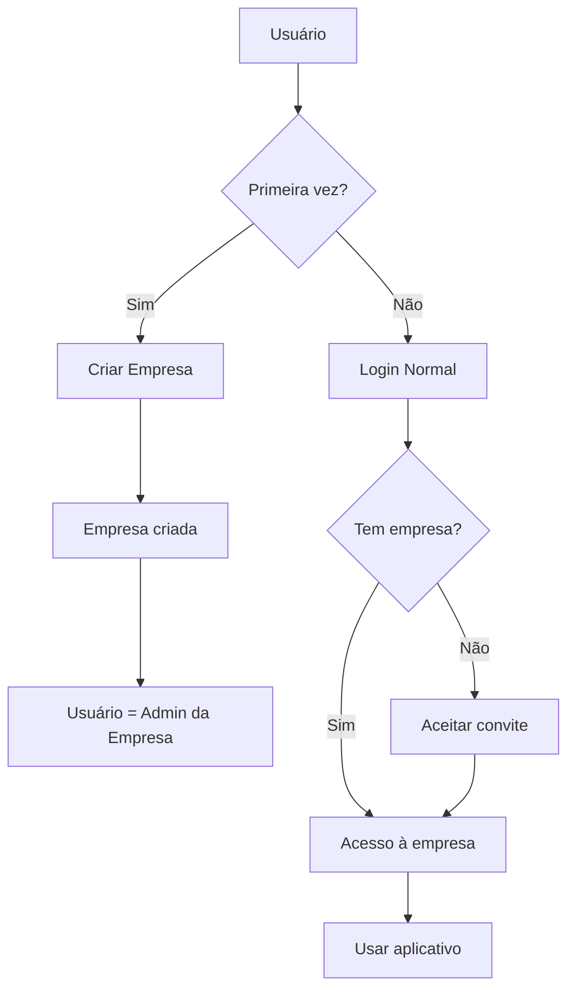

# 🏗️ Innoma Obras

**Aplicativo completo para gestão de obras** - React Native com Expo Router e **Arquitetura Multi-Tenant**

---

## 📱 Sobre o Projeto

O **Innoma Obras** é um aplicativo mobile desenvolvido para revolucionar a gestão de obras de construção civil. Com foco em **simplicidade**, **eficiência** e **modo offline-first**, oferece todas as ferramentas necessárias para gerenciar projetos de construção de forma profissional em uma **arquitetura multi-empresas**.

### ✨ Principais Características

- 🔄 **Modo Offline Completo** - Funciona sem internet
- 🏢 **Multi-Tenant** - Múltiplas empresas isoladas
- 🎨 **Design Moderno** - Interface limpa e intuitiva  
- 🌙 **Tema Dark/Light** - Adaptável à preferência do usuário
- 👥 **Gestão de Equipe** - Controle de permissões por papel
- 📊 **Relatórios Inteligentes** - Analytics e insights
- 🔒 **Segurança** - Autenticação robusta e dados criptografados

---

## 🏢 **NOVA ARQUITETURA MULTI-TENANT**

### 🎯 **Como Funciona:**



### 🔑 **Fluxos de Registro:**

#### **1. Criação de Nova Empresa**
```typescript
// Primeiro usuário cria empresa + conta
register({
  nome: "João Silva",
  email: "joao@construtora.com", 
  empresa: "Construtora Silva LTDA",
  password: "senha123"
})
// → Cria tenant + usuário como owner/admin
```

#### **2. Convite para Empresa Existente**
```typescript
// Admin convida novo membro
inviteUser({
  email: "maria@email.com",
  role: "engenheiro", 
  tenantId: "empresa-uuid"
})
// → Novo usuário aceita convite
acceptInvite(token, userData)
```

#### **3. Login Multi-Tenant**
```typescript
// Sistema identifica automaticamente a empresa do usuário
login({
  email: "joao@construtora.com",
  password: "senha123"
})
// → Usuário logado na empresa correta
```

---

## 🛠️ Tecnologias Utilizadas

### **Core**
- **React Native** + **Expo SDK 51**
- **TypeScript** - Tipagem estática
- **Expo Router** - Navegação file-based (estilo Next.js)

### **Multi-Tenant**
- **Firebase Auth** - Autenticação de usuários
- **Firestore** - Sincronização multi-tenant
- **SQLite** - Armazenamento local isolado por empresa

### **Banco de Dados**
- **SQLite** - Armazenamento local
- **Expo Secure Store** - Dados sensíveis
- **AsyncStorage** - Preferências do usuário

### **UI/UX**
- **Expo Linear Gradient** - Gradientes
- **React Native Reanimated** - Animações fluidas
- **Expo Vector Icons** - Ícones profissionais
- **React Native Gesture Handler** - Gestos nativos

### **Funcionalidades**
- **Expo Image Picker** - Câmera e galeria
- **Expo Location** - Geolocalização
- **Expo File System** - Gerenciamento de arquivos
- **Date-fns** - Manipulação de datas

---

## 📁 Estrutura do Projeto

```
📦 InnomaObras/
├── 📱 app/                          # Expo Router (file-based routing)
│   ├── _layout.tsx                  # Layout principal + AuthGuard
│   ├── index.tsx                    # Entry point
│   ├── 🔐 (auth)/                   # Autenticação
│   │   ├── login.tsx                # Login multi-tenant
│   │   ├── register.tsx             # Registro com criação de empresa
│   │   ├── forgot-password.tsx      # Recuperar senha
│   │   └── join-tenant.tsx          # Aceitar convite de empresa
│   ├── 📋 (tabs)/                   # Navegação principal
│   │   ├── index.tsx                # Dashboard da empresa
│   │   ├── obras.tsx                # Gestão de obras
│   │   ├── calendario.tsx           # Cronograma e agenda
│   │   ├── equipe.tsx               # Gestão de equipe
│   │   └── perfil.tsx               # Perfil + configurações empresa
│   ├── 🏗️ obra/[id]/               # Detalhes de obra específica
│   │   ├── diario.tsx               # Diário de obra
│   │   ├── tarefas.tsx              # Tarefas da obra
│   │   ├── cronograma.tsx           # Cronograma da obra
│   │   ├── materiais.tsx            # Materiais e estoque
│   │   ├── financeiro.tsx           # Custos e orçamento
│   │   ├── documentos.tsx           # Documentos da obra
│   │   ├── qualidade.tsx            # Controle de qualidade
│   │   └── configuracoes.tsx        # Configurações da obra
│   └── 📱 modal/                    # Modais globais
│       ├── adicionar-obra.tsx       # Criar nova obra
│       ├── adicionar-tarefa.tsx     # Criar tarefa
│       ├── registro-diario.tsx      # Registrar diário
│       ├── upload-documento.tsx     # Upload de arquivos
│       └── invite-user.tsx          # Convidar membro para empresa
├── 🔧 src/
│   ├── 🧩 components/               # Componentes reutilizáveis
│   │   ├── common/                  # Button, Input, Card, etc.
│   │   ├── forms/                   # Formulários específicos
│   │   └── charts/                  # Gráficos e visualizações
│   ├── 🌐 contexts/                 # Context API
│   │   ├── AuthContext.tsx          # Autenticação multi-tenant
│   │   ├── TenantContext.tsx        # 🆕 Gestão de empresas
│   │   ├── ThemeContext.tsx         # Tema Dark/Light
│   │   ├── NetworkContext.tsx       # Status de rede
│   │   └── PermissionsContext.tsx   # Permissões por empresa
│   ├── ⚡ services/                 # Serviços
│   │   ├── auth/                    # Autenticação multi-tenant
│   │   ├── database/                # SQLite + migrations
│   │   ├── sync/                    # Sincronização por empresa
│   │   ├── storage/                 # Armazenamento seguro
│   │   └── firebase/                # Configuração Firebase
│   ├── 🔗 hooks/                    # Custom hooks
│   ├── 🎨 constants/                # Cores, tamanhos, etc.
│   ├── 📝 types/                    # Tipos TypeScript
│   │   ├── index.ts                 # Tipos principais + BaseEntity
│   │   ├── auth.ts                  # Tipos de autenticação
│   │   └── tenant.ts                # 🆕 Tipos multi-tenant
│   └── 🛠️ utils/                    # Utilitários
└── 📎 assets/                       # Imagens, fontes, ícones
```

---

## 🚀 Como Executar

### **Pré-requisitos**

- Node.js 18+ 
- npm ou yarn
- Expo CLI
- Android Studio / Xcode (para emuladores)
- **Firebase Project** configurado para multi-tenant

### **Instalação**

```bash
# 1. Clonar o projeto
git clone https://github.com/seu-usuario/innoma-obras.git
cd innoma-obras

# 2. Instalar dependências
npm install

# 3. Configurar Firebase Multi-Tenant
cp .env.example .env
# Editar .env com suas credenciais Firebase

# 4. Executar no desenvolvimento
npx expo start
```

### **Configuração Firebase Multi-Tenant**

```javascript
// app.json - Configuração multi-tenant
{
  "expo": {
    "extra": {
      "firebaseApiKey": "sua-chave",
      "firebaseProjectId": "innoma-obras-multi",
      "enableMultiTenant": true
    }
  }
}
```

### **Executar em Dispositivos**

```bash
# Android
npx expo start --android

# iOS  
npx expo start --ios

# Web
npx expo start --web
```

---

## 🎯 Funcionalidades Implementadas

### ✅ **Etapa 1 - CONCLUÍDA: Infraestrutura Multi-Tenant**
- [x] Projeto React Native + TypeScript configurado
- [x] Expo Router com navegação file-based
- [x] **Arquitetura Multi-Tenant** completa
- [x] Tema Dark/Light automático
- [x] Estrutura de diretórios modular
- [x] Context API multi-empresa (Auth, Tenant, Theme, Permissions)
- [x] **Sistema de banco segregado por empresa**
- [x] **Firebase configurado para multi-tenant**

### ✅ **Etapa 2 - CONCLUÍDA: Autenticação Multi-Tenant**
- [x] Firebase Auth setup para múltiplas empresas
- [x] **Tela de registro que cria empresa + usuário owner**
- [x] **Sistema de convites por e-mail para empresas**
- [x] **Login automático detecta empresa do usuário**
- [x] Sistema de permissões por empresa e perfil
- [x] **TenantContext para gestão de empresas**
- [x] Persistência de sessão com empresa ativa

### ✅ **Etapa 3 - CONCLUÍDA: Banco Multi-Tenant**
- [x] **Esquema SQLite com tenant_id em todas as tabelas**
- [x] **Migrações preparadas para isolamento por empresa**
- [x] **Camada de repositórios com filtro automático por tenant**
- [x] **Sistema de sincronização isolado por empresa**
- [x] **Controle de limites por plano de empresa**

### 🚧 **Etapa 4 - EM ANDAMENTO: MVP Funcional Multi-Tenant**
- [ ] CRUD de obras isolado por empresa
- [ ] Gestão de equipe por empresa
- [ ] Diário de obra com tenant_id
- [ ] Sistema de tarefas isolado por empresa
- [ ] Interface principal com dados da empresa ativa

---

## 🏢 **DETALHES DA ARQUITETURA MULTI-TENANT**

### 🔑 **Isolamento de Dados**

```sql
-- ✅ Todas as tabelas têm tenant_id
CREATE TABLE obras (
    id INTEGER PRIMARY KEY,
    uuid TEXT UNIQUE,
    tenant_id TEXT NOT NULL, -- 🔑 ISOLAMENTO
    nome TEXT,
    -- ... outros campos
    FOREIGN KEY (tenant_id) REFERENCES tenants(id)
);

-- ✅ Índices otimizados para multi-tenant
CREATE INDEX idx_obras_tenant ON obras(tenant_id, status);
```

### 🔒 **Segurança Multi-Tenant**

```typescript
// ✅ Todas as queries filtram automaticamente por tenant
const obras = await executeSelectQuery(`
    SELECT * FROM obras 
    WHERE tenant_id = ? AND is_active = 1
`, [currentTenant.id]);

// ✅ Middleware automático de isolamento
const { currentTenant } = useTenant();
if (!currentTenant) throw new Error('Tenant não ativo');
```

### 📊 **Limites por Plano**

```typescript
interface TenantLimits {
    usuarios: { usado: 5, limite: 10, percentual: 50 };
    obras: { usado: 3, limite: 5, percentual: 60 };
    storage: { usado_mb: 100, limite_gb: 1, percentual: 10 };
}

// ✅ Verificação automática de limites
const canAddUser = () => tenantLimits.usuarios.usado < tenantLimits.usuarios.limite;
```

---

## 🎨 Design System

### **Cores Principais**
```typescript
primary: '#2563EB'      // Azul profissional
secondary: '#F97316'    // Laranja construção  
success: '#16A34A'      // Verde aprovação
warning: '#EAB308'      // Amarelo atenção
error: '#DC2626'        // Vermelho perigo
```

### **Componentes**
- **Button** - 4 variantes (primary, secondary, outline, ghost)
- **Input** - Com ícones, validação e estados
- **Card** - 3 variantes (default, elevated, outlined)

### **Tipografia**
- **Heading** - Inter Bold (títulos)
- **Body** - Inter Regular (texto corrido)
- **Caption** - Inter Medium (legendas)

---

## 👥 Sistema de Permissões Multi-Tenant

```typescript
// 🏢 Perfis por empresa
enum TenantRole {
  OWNER = 'owner',           // Dono da empresa (máximo controle)
  ADMIN = 'admin',           // Administrador da empresa
  ENGENHEIRO = 'engenheiro', // Gerencia obras
  MESTRE = 'mestre',         // Coordena equipe  
  OPERARIO = 'operario',     // Executa tarefas
  VISITANTE = 'visitante'    // Apenas visualização
}

// ✅ Verificação de permissão por empresa
const { canManageUsers, currentTenant } = useTenant();
if (canManageUsers()) {
    // Usuário pode gerenciar outros usuários desta empresa
}
```

---

## 📋 Fluxos de Usuário Multi-Tenant

### **1. Primeiro Usuário (Criar Empresa)**
```
1. Usuário acessa app pela primeira vez
2. Clica em "Criar Nova Empresa"
3. Preenche: Nome, Email, Empresa, Senha
4. Sistema cria:
   - Tenant (empresa) no Firebase/SQLite
   - Usuário como owner da empresa
   - Configurações padrão da empresa
5. Usuário logado como admin da nova empresa
```

### **2. Convite para Empresa**
```
1. Admin acessa "Equipe" → "Convidar Membro"
2. Preenche: Email, Perfil (engenheiro/mestre/etc.)
3. Sistema envia email com link de convite
4. Convidado clica no link
5. Se já tem conta: apenas aceita convite
6. Se não tem conta: cria conta + aceita convite
7. Usuário logado na empresa que o convidou
```

### **3. Login Automático**
```
1. Usuário faz login com email/senha
2. Sistema consulta: qual empresa esse usuário pertence?
3. Carrega dados da empresa automaticamente
4. Interface mostra dados isolados da empresa
```

---

## 🧪 Como Testar Multi-Tenant

### **Cenário 1: Criar Primeira Empresa**
```bash
1. npx expo start
2. Registro → "Criar Nova Empresa"
3. Dados: João Silva, joao@silva.com, "Silva Construções"
4. Verificar: empresa criada + usuário como owner
```

### **Cenário 2: Convidar Segundo Usuário**
```bash
1. Login como João Silva (admin)
2. Equipe → Convidar → maria@silva.com (engenheiro)
3. Simular aceite do convite
4. Login como Maria → deve ver dados da "Silva Construções"
```

### **Cenário 3: Isolamento de Dados**
```bash
1. Criar segunda empresa: "Costa Engenharia"
2. Criar obras em ambas empresas
3. Verificar: João vê apenas obras da Silva
4. Verificar: Maria vê apenas obras da Silva
```

---

## 🔧 Configurações de Desenvolvimento

### **Firebase Multi-Tenant**
```javascript
// firestore.rules - Regras de segurança por empresa
rules_version = '2';
service cloud.firestore {
  match /databases/{database}/documents {
    // Usuários só acessam dados da própria empresa
    match /obras/{obraId} {
      allow read, write: if resource.data.tenant_id == 
                           get(/databases/$(database)/documents/users/$(request.auth.uid)).data.tenant_id;
    }
  }
}
```

### **SQLite Multi-Tenant**
```sql
-- Trigger automático para inserir tenant_id
CREATE TRIGGER insert_tenant_id_obras
BEFORE INSERT ON obras
FOR EACH ROW
WHEN NEW.tenant_id IS NULL
BEGIN
    SELECT RAISE(ABORT, 'tenant_id é obrigatório');
END;
```

---

## 📊 Métricas por Empresa

### **Dashboard da Empresa**
- Obras ativas da empresa
- Equipe da empresa  
- Orçamento total da empresa
- Progresso médio das obras
- Uso de recursos (usuários, storage, etc.)

### **Limites por Plano**
```typescript
const planLimits = {
    basic: { users: 5, projects: 3, storage_gb: 1 },
    pro: { users: 25, projects: 15, storage_gb: 10 },
    enterprise: { users: 100, projects: 50, storage_gb: 50 }
};
```

---

## 🤝 Contribuição Multi-Tenant

### **Padrões de Código Multi-Tenant**
```typescript
// ✅ Sempre filtrar por tenant_id
const getObras = async () => {
    const { currentTenant } = useTenant();
    return await executeSelectQuery(`
        SELECT * FROM obras WHERE tenant_id = ?
    `, [currentTenant.id]);
};

// ✅ Verificar permissões por empresa
const { canManageObras } = usePermissions();
if (!canManageObras()) {
    throw new Error('Sem permissão nesta empresa');
}
```

---

## 📄 Licença

Este projeto está sob licença **MIT**. Veja o arquivo [LICENSE](LICENSE) para mais detalhes.

---

## 📞 Suporte Multi-Tenant

- **Email**: suporte@innoma.com
- **GitHub**: [Issues](https://github.com/seu-usuario/innoma-obras/issues)
- **Docs Multi-Tenant**: [Wiki](https://github.com/seu-usuario/innoma-obras/wiki/multi-tenant)

---

**Desenvolvido com ❤️ para revolucionar a gestão de obras com arquitetura multi-empresa** 🏢🇧🇷